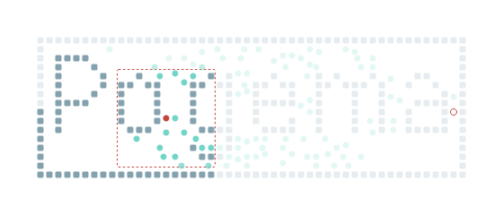
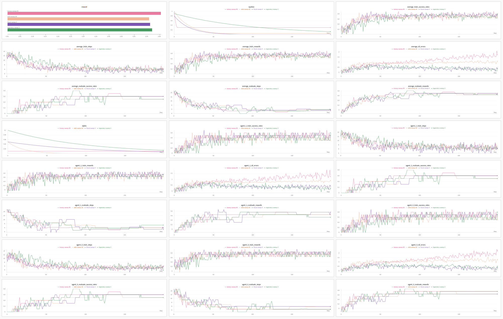
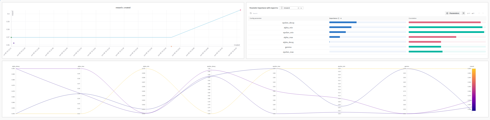

# Distributed Reinforcement Learning in Multi-Agent Environments

[](https://www.python.org/downloads/release/python-3100/)
[](LICENSE)
[](https://wandb.ai)
[](https://github.com/AIRI-Institute/pogema)

This project corresponds to the **third assignment** of the course *Distributed Intelligent Systems* (SID) at the **Facultat d'Informàtica de Barcelona (FIB), UPC**. It is a complementary course in the Computer Science major within the Informatics Engineering degree. The assignment accounts for **10% of the final grade**.

The installation and execution instructions are provided below.

## 🌍 Objective

The aim of this assignment is to explore **Reinforcement Learning algorithms** in a **partially observable, multi-agent environment**. As we already had background in **Game Theory**, our primary focus was on **Joint-Action Learning with Game-Theoretic solution concepts**.

We implemented and experimented with the following solution concepts:

- **Pareto Optimality**
- **Nash Equilibria**
- **Welfare Maximization**
- **Minimax Strategy**

These solution profiles are **mixed strategies**, to average among multiple optimal joint actions. To extend the scope of the assignment, we also implemented a **policy-gradient method**: the **REINFORCE** algorithm.

## 🧹 Environment: POGEMA

The environment used is [**Pogema**](https://github.com/AIRI-Institute/pogema), a Python-based multi-agent grid-world environment designed for studying pathfinding and coordination under **partial observability**. Each agent must reach a goal while coordinating implicitly with others.



## 📊 Original Template and Setup

The original ZIP file provided by the teaching team was `sid-2425q2-lab3.zip`, which contained a suggested skeleton. However, we decided to build our own architecture to enable **integration with [Weights & Biases (wandb)](https://wandb.ai/)**. This allowed us to run large-scale **hyperparameter sweeps** more easily. The assignment description (in Spanish) is available in `sid_202425_l3.pdf`.


## ❓ Research Questions

The project aimed to explore the following questions:

1. **Which parameters and values lead to better convergence in terms of both individual and collective reward? And in terms of training time?**
2. **How do agents behave when trained with different solution concepts (Minimax, Nash, Welfare, Pareto)? Which coordination scenarios are better suited for each?**
3. **What happens when two agents use different solution concepts? Can they coordinate, or achieve good individual rewards independently?**
4. **How does JAL-GT compare to IQL (Independent Q-Learning), given that JAL-GT is a joint-action method?**
5. **Can the algorithm generalize? How does it scale with environment size (2x2 to 8x8), number of agents (2 to 4), and state representation complexity?**
6. **Can the algorithm generalize well enough to succeed in unseen maps?**

## ⭐ Bonus Task

Additional **2 extra points** (for a maximum grade of 12) where given by implementing a RL algorithm using either:
- A **linear approximation model** for state representation,
- A **neural network**, or
- A **policy gradient algorithm**.

We chose to implement **REINFORCE**, a gradient-based method.

## 👥 Team and Work Distribution

Team members:
- [Francisco Badia Laguillo](https://github.com/siscubl04)
- [José Durán Foix](https://github.com/jdf0607)
- [Lluc Santamaria Riba](https://github.com/Lluc24)

We divided the work as follows:

- [**Lluc**](https://github.com/Lluc24) focused on the first three research questions, analyzing convergence properties, behavior under different solution concepts, and coordination when using heterogeneous strategies.
- [**José**](https://github.com/jdf0607) handled the analysis comparing JAL-GT and IQL, as well as generalization across environment sizes and map types.
- [**Francisco**](https://github.com/siscubl04) implemented and experimented with the **REINFORCE algorithm**, conducting the bonus experiment.

Each experiment addressed specific questions:

- **Experiment 1**: Questions 1 and 2
- **Experiment 2**: Question 3
- **Experiment 3**: Question 4
- **Experiment 4**: Question 5
- **Experiment 5**: Question 6
- **Experiment 6**: Bonus (REINFORCE)

## ⚖️ Parameters and Hyperparameters

We explored a wide range of **parameters** and **hyperparameters**, including:

- **Environment settings**:
  - Number of agents
  - Grid size
  - Obstacle density

- **Algorithmic choices**:
  - JAL-GT vs REINFORCE
  - Solution concept (Minimax, Nash, etc.)

- **Learning configuration**:
  - Number of epochs and episodes
  - Reward shaping functions
  - Learning rate (initial, min, decay factor)
  - Exploration factor (initial, min, decay)

## 🔬 Evaluation Metrics

To evaluate experiment quality and performance, we monitored:

- **Execution times**:
  - Per sweep
  - Total experiment duration

- **Rewards**:
  - Collective and individual rewards over time

- **Exploration & learning rate**:
  - Evolution of hyperparameters during training

- **Success rates**:
  - During training and evaluation
  - Individual and collective

- **Efficiency metrics**:
  - Steps needed to reach goals
  - Temporal Difference (TD) errors

These were tracked using **wandb**, enabling visual insights and comparisons:




## ⚡ Difficulties Faced

1. **Dependency Conflicts**: Pogema required `pydantic<2`, while wandb needed `pydantic>=2`. We resolved this by creating **two separate virtual environments**: one for Pogema, and one for wandb, communicating via serialized files.

2. **Scalability Bottlenecks**: JAL-GT with matrix-based Q-tables became inefficient in large state-action spaces, consuming a lot of memory. REINFORCE, using gradient descent, scaled better.

3. **Timing Issues**: The deadline coincided with the final exams. Due to academic pressure, coordinating and progressing through the assignment was challenging. Early planning would have helped.

## 📦 Delivery

The assignment was delivered on **June 14, 2025**, and can be found in the archive file `delivery.zip`.  
The complete report (in Spanish) is also included as `Documentacion.pdf`.

## 🌟 Final Result

We obtained a grade of **11.75/12**, broken down as:
- Base grade: **9.75**
- Bonus: **+2.0** for REINFORCE implementation

---

## 🔧 Setup

## 💡 Requirements

* Python **3.6+** (this project was developed with **Python 3.10.13**)

We recommend using **two separate virtual environments**:

* One for `pogema` and its dependencies
* One for `wandb` and logging experiments

## ⚙️ Installation

Open **two terminals** and follow the steps below, one for each environment.

### 🔹 Terminal 1: Pogema Environment

```bash
python3 -m venv pogema-env
source pogema-env/bin/activate
pip install -r requirements-pogema.txt
```

### 🔸 Terminal 2: Weights & Biases (wandb) Environment

```bash
python3 -m venv wandb-env
source wandb-env/bin/activate
pip install wandb
```

Make sure you're logged in to your [Weights & Biases account](https://wandb.ai/):

```bash
wandb login
```

---

## 📊 How to Replicate the Experiments

Use the **second terminal** (with `wandb-env` activated) to run the experiments.

### 🧪 Experiment 1: Comparing Game-Theoretic Solution Concepts

Test each solution concept by running:

#### 🔹 Pareto

```bash
python3 sweep_runner.py --script experiment1.py --sweep sweeps/sweep1.json --count=100 --solution-concept=Pareto
```

#### 🔹 Nash

```bash
python3 sweep_runner.py --script experiment1.py --sweep sweeps/sweep1.json --count=100 --solution-concept=Nash
```

#### 🔹 Welfare

```bash
python3 sweep_runner.py --script experiment1.py --sweep sweeps/sweep1.json --count=100 --solution-concept=Welfare
```

#### 🔹 Minimax

```bash
python3 sweep_runner.py --script experiment1.py --sweep sweeps/sweep1.json --count=100 --solution-concept=Minimax
```

### 🧪 Experiment 2: Hybrid Strategy (Pareto + Nash)

```bash
python3 sweep_runner.py --script experiment1.py --sweep sweeps/sweep2.json --count=1 --solution-concept Pareto Nash
```

### 🧪 Experiment 3: JAL-GT vs IQL

```bash
python3 sweep_runner.py --script experiment3.py --sweep sweeps/sweep1.json --count=100 --solution-concept=Pareto
```

### 🧪 Experiment 4: Generalization Tests

#### 🔸 Map size 8×8

```bash
python3 sweep_runner.py --script experiment4.py --sweep sweeps/sweep4.json --count=1 --solution-concept=Pareto
```

#### 🔸 3 agents scenario

```bash
python3 sweep_runner.py --script experiment4.py --sweep sweeps/sweep5.json --count=1 --solution-concept=Pareto
```

### 🧪 Experiment 5: Metrics on Custom Maps

Use the **first terminal** (with `pogema-env`) to generate metrics:

```bash
python experiment5.py --metrics newMaps --solution-concept Pareto
```

Results are saved to: `./newMaps/metrics.json`

### 🧪 Extra Experiment: REINFORCE Policy Gradient

To train agents using REINFORCE:

```bash
python3 sweep_runner.py --script experimentExtra.py --sweep sweeps/sweepExtra_1.json --count=126
```
